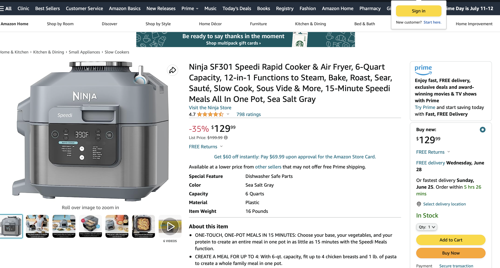

# Amazon_bot_text_demo

This demo utilizes the pdx library to provide a amazon bot text response regarding to a ninja air fryer. The amazon screenshot of the airfryer is shown below:



## Installation
> Upgrade Python


First, we encourage you to check and upgrade your python to the newest version (3.11.4). Open your local terminal and type

```bash
python3 --version
```
And output will tell you which python version you are now using, preferably it shows
```bash
Python 3.11.4
```
If the version is below 3.9, please upgrade python following this websites instruction:
[Updating python version by python central](https://www.pythoncentral.io/how-to-update-python/)

> Download the library

Please feel free to create a new fork for this library and clone it down to your own local environment.
Here is [github documentation](https://docs.github.com/en/get-started/quickstart/fork-a-repo) on creating new forks and downloading repo.

>Get your own OpenAI key

Click [here](https://help.openai.com/en/articles/4936850-where-do-i-find-my-secret-api-key) to create your secret api key.

## Compilation

When you download the library in the local environment (such as VSCode), create a new terminal and make sure you are in pdx library.

Then type code below to change the directory in to tests folder.
```python
cd demos/amazon_bot_text_demo/tests
```
To double check, you can also type
```python
ls
```
and the expected output is 
```python
test.py
```
Yayy, you are on the right spot!

## Content Explaination
Now, let us look through the files in this demo folder.
> air_fryer_prompt.defauls.yaml

The contents over this default file is copied from the amazon webpage regarding to the air fryer, so our AI model will output responses based on the default content. This file contains the product name, features, top review, and a url link.

> air_fryer_prompt.jinja

This is a template file to provide template for the output. When we choose to input a question for the AI, this template will limit the output to one answer, three relative facts, one related question, the answer to the related question.

> config.yaml

This is the configuration file for us to choose the model for messages and the template for output. We choose to use devanci-003 since we are using text demo. More complicated configuration will be shown in chat agent and advanced agent.

>test.py

This is a test file for us to input our question into thie file. 

In line 9, there is a place where you should copy your own secret api key to the place between the quotes.

In line 15, there is a line:
```
question="Can i use this air fryer in England?"
```
We can change this line to change the question and the program will provide us different outputs based on the input.

## Coding Samples

How can we run the code?

First, make sure that you are in the test directory.

Second, type the following in your local terminal:

```
python test.py
```
If you are in Mac and the above code report error, please try 
```
python3 test.py
```
And wait for 30 seconds, you should have your output in your terminal!

For example, if the question is still Can I use this air fryer in England?

The output I generated is 

```
Can i use this air fryer in England?


{
    "answer": "No, this air fryer is not compatible with the voltage in England.",
    "facts": [
        "The voltage for this air fryer is 120 Volts.",
        "The voltage in England is 230 Volts.",
        "This air fryer is not compatible with the voltage in England."
    ],
    "other concern": "Can I use a voltage converter to use this air fryer in England?",
    "answer to other concern": "No, using a voltage converter is not recommended as it may damage the air fryer."
}
```
This output is exactly what I want, if we read the default.yaml carefully, then we will notice that the top review mentions that this air fryer cannot be used in England base on voltage difference.

Feel free to change line 15 in test.py to try out more questions!

## Contributing

Pull requests are welcome. For major changes, please open an issue first
to discuss what you would like to change.

Please make sure to update tests as appropriate.


