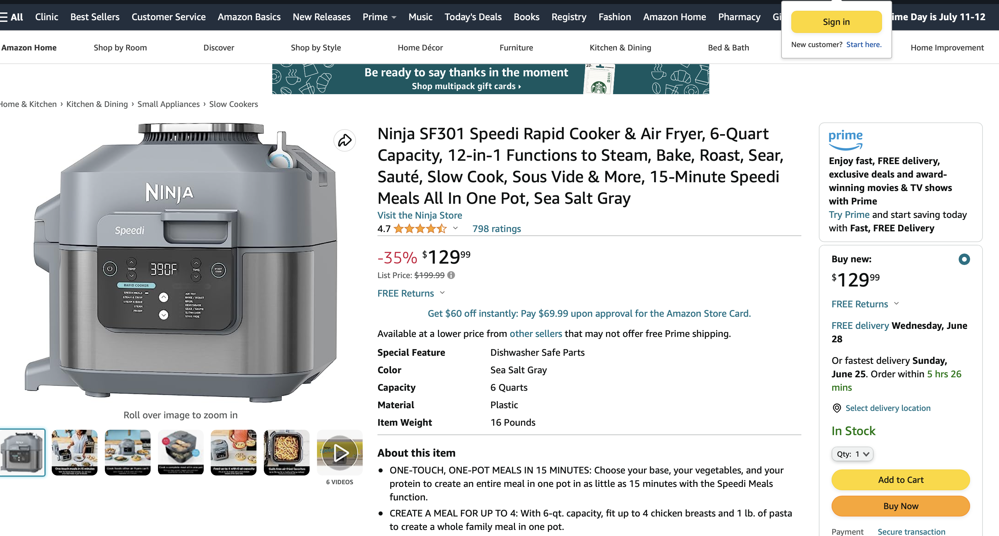

# Amazon_bot_text_demo

This demo utilizes the pdx library to provide a amazon bot text response regarding to a ninja air fryer. The amazon screenshot of the airfryer is shown below:



## Installation

### Install PDX

In your local Python environment, install `pdx`:

```bash
pip install pdx
```

More information about [PDX here](https://pdxlabs.io/docs/getting-started/introduction).

### Get the demo

Please feel free to clone this reposiroty of demos to your own local environment.

> Get your own OpenAI key

Click [here](https://help.openai.com/en/articles/4936850-where-do-i-find-my-secret-api-key) to create your secret api key.

## Compilation

Make sure have all the code necessary for this demo (for instance by downloading it).

To double check the files:

```bash
ls
```

and the expected output contains

```python
agent.py                air_fryer_photo.png     config.yaml             Readme.md               templates               tests
```

Yayy, you are on the right spot!

## Content Explaination

Now, let us look through the files in this demo folder.

> air_fryer_prompt.defauls.yaml

The contents over this default file is copied from the amazon webpage regarding to the air fryer, so our AI model will output responses based on the default content. This file contains the product name, features, top review, and a url link.

> air_fryer_prompt.jinja

This is a template file to provide template for the output. When we choose to input a question for the AI, this template will limit the output to one answer, three relative facts, one related question, the answer to the related question.

> config.yaml

This is the configuration file for us to choose the model for messages and the template for output. We choose to use text-davinci-003 since we are using text demo. More complicated configuration will be shown in other agents.

> test_1.yaml

This is the test in the local to see if the agent is running as expected.

> agent.py

This is a test file for us to input our question into thie file.

In line 10, there is a place where you should change the folder path to your amazon_bot_text_demo path on local.

In line 15, there is a line:

```
question="Can i use this air fryer in England?"
```

We can change this line to change the question and the program will provide us different outputs based on the input and implement in the applications.

## Testing

We use test_1.yaml file to run test in local environment to make sure it works in local environment

If you are running Mac OS/ linux, type below in your terminal:

```
export OPENAI_KEY="your secret key"
```

Next,type below in the terminal:

```
pdx test /CHANGE THIS TO YOUR PATH/amazon_product_bot --verbose
```

Now you will see in your terminal,test_1 is running!

## Coding Samples

How can we run the code?

First, make sure that you are in the test directory.

Second, type in your API key in terminal.

If you are running Mac OS/ linux, type below in your terminal:

```
export OPENAI_KEY="your secret key"
```

Third, type the following in your local terminal:

```
python agent.py
```

If you are in Mac and the above code report error, please try

```
python3 agent.py
```

And wait for 30 seconds, you should have your output in your terminal!

For example, if the question is still Can I use this air fryer in England?

The output I generated is

```
Can i use this air fryer in England?


{
    "answer": "No, this air fryer is not compatible with the voltage in England.",
    "facts": [
        "The voltage for this air fryer is 120 Volts.",
        "The voltage in England is 230 Volts.",
        "This air fryer is not compatible with the voltage in England."
    ],
    "other concern": "Can I use a voltage converter to use this air fryer in England?",
    "answer to other concern": "No, using a voltage converter is not recommended as it may damage the air fryer."
}
```

This output is exactly what I want, if we read the default.yaml carefully, then we will notice that the top review mentions that this air fryer cannot be used in England base on voltage difference.

Feel free to change line 15 in test.py to try out more questions!

## Contributing

Pull requests are welcome. For major changes, please open an issue first
to discuss what you would like to change.

Please make sure to update tests as appropriate.
